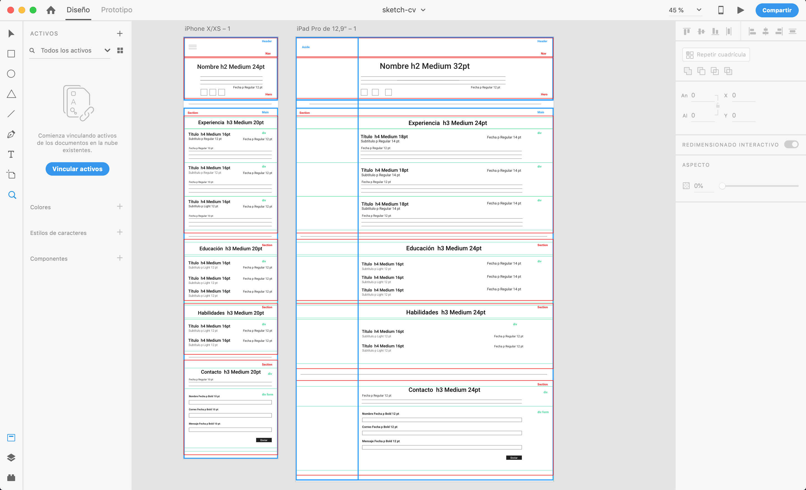

# curriculum

¿Qué tipo de patrón usaste para el proyecto?
Patrón Mostly fluid.

¿Por qué decidiste utilizar este patrón y no otro?
Utilicé este patrón ya que permite fluir la  mayor  parte  del tiempo y así ayuda a homogeneizar la experiencia en diferentes dispositivos.

¿Qué tecnología y/o estrategias usarás para que la maqueta sea responsiva?

La estrategia que se empleará será utilizar las directivas de CSS o Media Queries, que permitirán agregar estilos en ciertos tamaños sólo si la condición es cierta.

Además será necesario recurrir a grillas ya que cumplen una función primordial en el diseño responsivo, permitiéndoos conocer cómo se moverá el flujo de los elementos y cómo se dispondrá el contenidos  sin  importar  el  tamaño  de dispositivo a usar.

Diseño responsivo:

